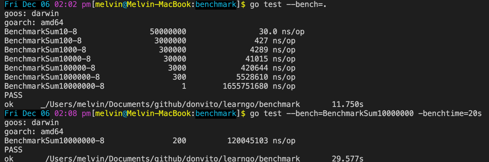

Run the benchmarks

```
go test --bench=.
```

Set a minimum time to run a specific benchmark
```
go test --bench=BenchmarkSum10000000 -benchtime=20s
```



Reference

https://dave.cheney.net/2013/06/30/how-to-write-benchmarks-in-go