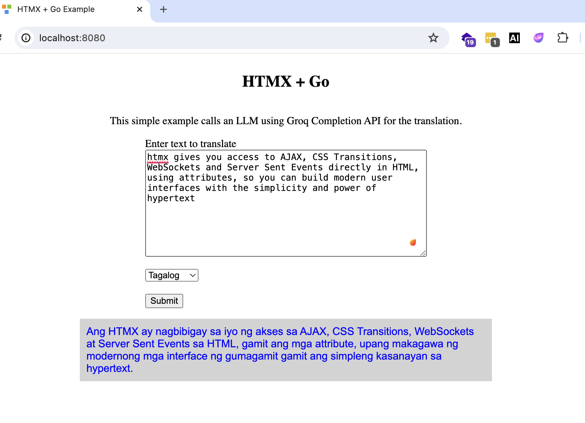

# HTMX and Go
This is a simple example of how to use HTMX and Go. 



Although translation might not be the best example to use with LLMs since
sometimes it has translation errors, this example is just to demonstrate how to create a simple
web application which used htmx and call a Go backend.

I am using Groq APIs for this example.

## Architecture
HTML -> form post using HTMX --> Go

## Files
- go.mod - Optional. I just added it since I am using Goland to debug.
- groq_client.go - Client code which calls the Groq API which need for our LLM requirements
- index.html - This is the entry point of our web app. It contains the htmx client code.
- main.go - This runs the http server and serves index.html and APIs called by our web app
- translation.html - This is the html template we use to show the translated text in the app.

## How to run
```bash
$ go run .
```
